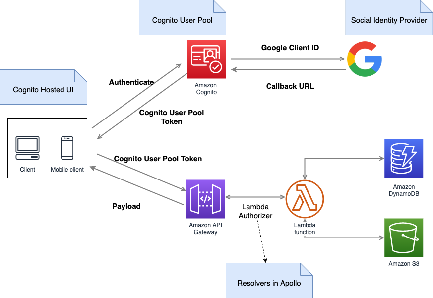

## Authentication

### References

-  [Authentication with a User Pool](https://docs.aws.amazon.com/cognito/latest/developerguide/authentication.html)
-  [Using the Amazon Cognito Hosted UI for Sign-Up and Sign-In](https://docs.aws.amazon.com/cognito/latest/developerguide/cognito-user-pools-app-integration.html)
-  [How do I configure the hosted web UI for Amazon Cognito?](https://aws.amazon.com/premiumsupport/knowledge-center/cognito-hosted-web-ui/)
